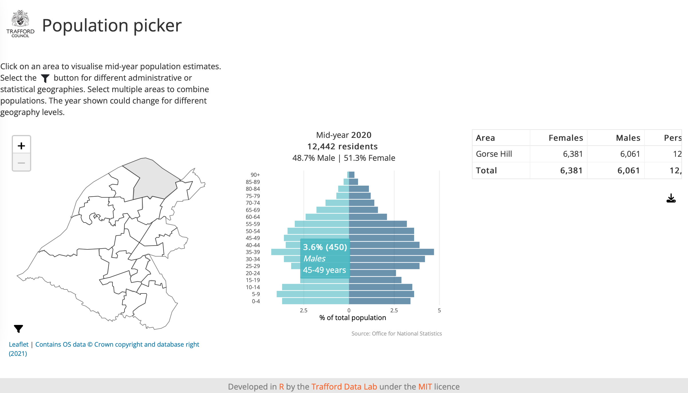

## Population picker
An <a href="https://cran.r-project.org/" target="_blank">R</a> <a href="https://cran.r-project.org/web/packages/shiny/index.html" target="_blank">Shiny</a> app allowing users to interrogate mid-year population estimates at different administrative and statistical geographies. Population estimates derive from the [Office for National Statistics](https://www.ons.gov.uk/peoplepopulationandcommunity/populationandmigration/populationestimates).

<br>



<br />

The app can be viewed at <a href="https://trafforddatalab.shinyapps.io/population_picker/" target="_blank">https://trafforddatalab.shinyapps.io/population_picker/</a>

To run the app locally execute the following code:

``` r
shiny::runGitHub("trafforddatalab/population_picker")
```
